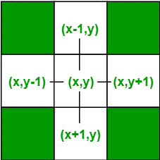
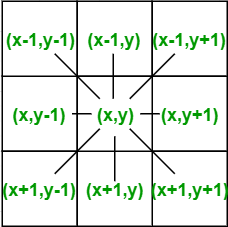

# Flood Fill Algorithm

## Đặc điểm:
- Là thuật toán duyệt và lan tỏa từ một điểm và lan rộng ra các điểm kề bên.

## Chức năng:
- Tìm hoặc tô màu các vùng liền kề trong ma trận.
- Lan tỏa từ một điểm ra các ô theo các hướng (trái, phải, trên, dưới).

## Ví dụ:
``` cpp
    void flood_fill(int x, int y) {
        if (x < 0 || x >= rows || y < 0 || y >= cols || locate[x][y] != 0) return;
        locate[x][y] = 2;           // danh dau o da loang
        int dx[4] = {-1, 1, 0, 0};  // di chuyen theo 4 huong
        int dy[4] = {0, 0, -1, 1};  // di chuyen theo 4 huong
        for (int i = 0; i < 4 ; ++i)
            flood_fill(x + dx[i], y + dy[i]);
    }
```
- `x`, `y`: tọa độ ô hiện tại. Dùng `x`, `y` để xác định vị trí so với biên.
  - `x` = `rows`
  - `y` = `cols`
- `locate[x][y]`: là mảng lưu trạng thái từng ô.
  - `0`: ô trống (chưa loang).
  - `1`: vật cản (không thể loang qua).
  - `2`: ô đã loang.
- `dx`, `dy`: mảng hỗ trợ di chuyển theo 4 hướng (trái, phải, trên, dưới) hoặc 8 hướng (nếu cần).
  - {-1, 0} ; {1, 0} ; {0, -1} ; {0, 1}
  
    

  - {-1, -1} ; {-1, 0} ; {-1, 1} ; {0, -1} ; {0, 1} ; {1, -1} ; {1, 0} ; {1, 1}

    

- Điều kiện dừng: ra ngoài biên, gặp vật cản hoặc đã đánh dấu -> return.
- Đánh dấu: Ô đang xét được đánh dấu giá trị 2 (đã loang).

## Cách hoạt động:
Start: (x=0, y=0)
1. Tại (0,0): đánh dấu 2, gọi đệ quy 4 hướng.
   flood_fill(1,0), flood_fill(-1,0), flood_fill(0,1), flood_fill(0,-1)
2. Tại (1,0): đánh dấu 2, gọi đệ quy 4 hướng.
   flood_fill(2,0), flood_fill(0,0), flood_fill(1,1), flood_fill(1,-1)
3. Cứ tiếp như vậy, lan tỏa đến các ô kề bên cho đến khi không thể lan nữa.

## Ứng dụng:
- Tô màu vùng liền kề trong các phần mềm vẽ.
- Tìm thành phần liên thông trong đồ thị lưới.
- Giải bài toán "bao vây" trên ma trận.
